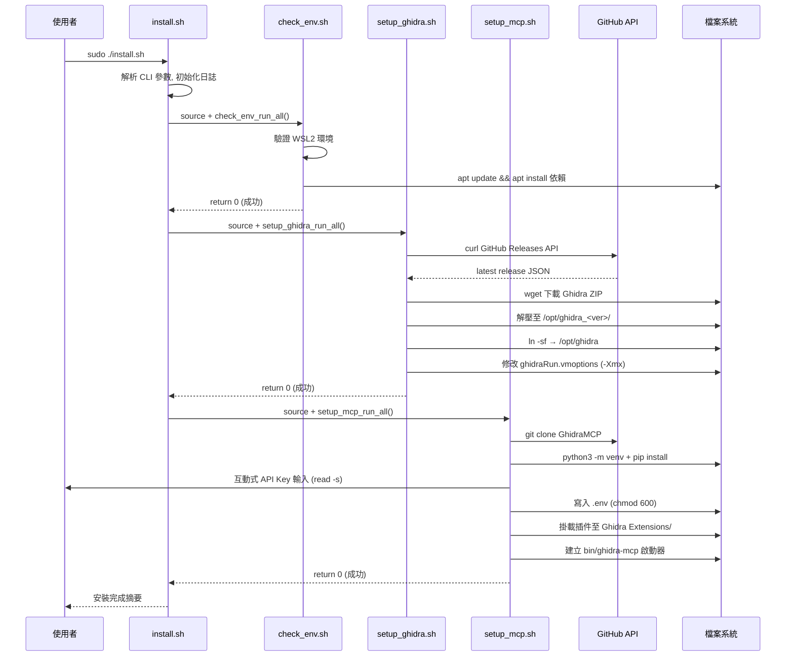

# Architecture — 系統架構文件

| 欄位 | 內容 |
|------|------|
| **專案** | Ghidra-MCP-WSL-Auto |
| **版本** | v0.1.0 |
| **最後更新** | 2026-02-26 |

---

## 系統概覽

> Ghidra-MCP-WSL-Auto 是一個自動化 Bash 腳本工具，在 WSL2 (Ubuntu/Debian) 環境下一鍵部署 Ghidra 逆向工程平台及 GhidraMCP (Model Context Protocol) 插件。透過模組化的腳本架構，自動完成環境初始化、Ghidra 安裝、MCP 插件整合與啟動器配置，讓安全研究人員快速獲得 AI 輔助的逆向分析能力。

---

## 架構圖

```mermaid
graph TD
    U[使用者] -->|sudo ./install.sh| MAIN[install.sh<br/>主進入點 / 流程編排器]

    MAIN -->|source| CE[scripts/check_env.sh<br/>F1: 環境檢測]
    MAIN -->|source| SG[scripts/setup_ghidra.sh<br/>F2: Ghidra 安裝]
    MAIN -->|source| SM[scripts/setup_mcp.sh<br/>F3: MCP 插件配置]
    MAIN -->|建立| BIN[bin/ghidra-mcp<br/>F4: 一鍵啟動器]

    CE -->|apt install| APT[(系統套件庫<br/>OpenJDK 21, Python 3.10+<br/>wget, jq, X11 libs)]
    SG -->|curl API| GH[(GitHub API<br/>NationalSecurityAgency<br/>/ghidra/releases)]
    SG -->|wget| ZIP[/tmp/ghidra_*.zip]
    SG -->|解壓| OPT[/opt/ghidra/]
    SM -->|git clone| MCP[(GitHub<br/>LaurieWired<br/>/GhidraMCP)]
    SM -->|python3 -m venv| VENV[/opt/ghidra-mcp/<br/>GhidraMCP/.venv/]
    SM -->|read -s| ENV[.env<br/>API Key 安全儲存]

    BIN -->|啟動| OPT
    BIN -->|啟動| VENV
```

---

## 模組清單

| 模組 | 檔案 | 職責 | 對應 SRS |
|------|------|------|----------|
| 主腳本 | install.sh | 流程編排、CLI 參數解析、日誌系統 | F1~F4 |
| 環境檢測 | scripts/check_env.sh | WSL2 驗證、apt 依賴安裝、JDK/Python 檢查 | F1 |
| Ghidra 安裝 | scripts/setup_ghidra.sh | 版本取得、下載、解壓、JVM 記憶體調校 | F2 |
| MCP 配置 | scripts/setup_mcp.sh | Clone 儲存庫、venv 建置、插件掛載、API Key 設定 | F3 |
| 啟動器 | bin/ghidra-mcp | 一鍵啟動 Ghidra + MCP Bridge | F4 |
| 環境模板 | config/.env.template | API Key 與 MCP 設定範本 | F3 |
| 桌面捷徑 | config/ghidra.desktop | Linux 桌面快捷方式 | F4 |

---

## 資料流

> 安裝流程的執行順序與各模組間的資料傳遞。



---

## 外部依賴

| 依賴 | 用途 | 版本 | 替代方案 |
|------|------|------|----------|
| OpenJDK | Ghidra 執行環境 | 21 | - |
| Python | GhidraMCP Bridge | 3.10+ | - |
| jq | GitHub API JSON 解析 | 1.6+ | python3 -c json |
| wget | Ghidra ZIP 下載（支援斷點續傳） | - | curl -C |
| git | GhidraMCP 儲存庫 clone | - | - |
| X11 libs | Ghidra GUI 顯示 | - | headless 模式 (受限) |
| Ghidra | 逆向工程平台 | 11.x (latest) | - |
| GhidraMCP | MCP 插件 | latest | - |

---

## 安全邊界

> **API Key 保護流程：**
> 1. 互動輸入：`read -s`（不回顯至終端）
> 2. 儲存：`.env` 檔案，權限 `chmod 600`，擁有者 `$SUDO_USER`
> 3. 日誌遮罩：`sanitize_log()` 函式過濾所有形如 `sk-*` / `anthropic-*` 的字串
> 4. 版控排除：`.gitignore` 包含 `.env` 和 `*.log`
>
> **檔案權限模型：**
> | 路徑 | 擁有者 | 權限 |
> |------|--------|------|
> | /opt/ghidra/ | root:root | 755 |
> | /opt/ghidra-mcp/ | root:root | 755 |
> | .env (API Key) | $USER:$USER | 600 |
> | install.log | root:root | 644 |

---

## 已知技術債

- [x] bats-core 測試框架已建立，35 個真實函式驗證測試（非骨架）
- [ ] GitHub API 未認證限制 60 req/hr，未實作 rate limit 重試
- [ ] 不支援 proxy 環境下的安裝
- [ ] 不支援 WSL1（缺少完整 Linux kernel）
- [ ] GhidraMCP 插件需從 GitHub Release 取得預編譯版本或本機 Gradle 編譯，兩條路徑尚未完整驗證

---

## 關聯 ADR

- ADR-001：初始技術棧選型
